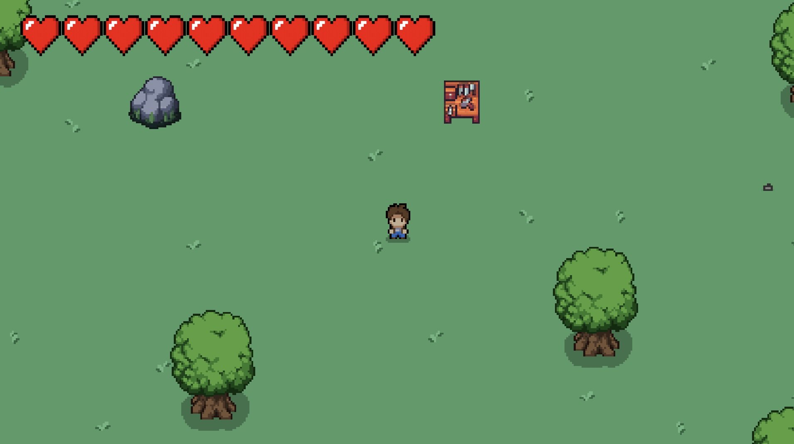

# Hollow Descent

  

[Watch the demo](https://youtu.be/5RCdGD0zczw)

**Hollow Descent** is a 2D survival adventure game developed as a project for my CS583 Game Design class.  
It was created in Unity using C#, and focuses on core gameplay systems such as crafting, combat, and resource gathering.  
The goal of the project was to design a cohesive gameplay loop that encourages exploration, progression, and player decision-making.

---

## Overview

The game begins with the player on the surface, where they can gather basic materials like wood and stone.  
These resources can then be used to craft weapons, tools, and equipment that allow the player to venture deeper into an underground cave system.  
As players descend, they encounter stronger enemies and rarer materials, creating a balance between risk and reward.

This project was developed to demonstrate the implementation of several interconnected systems within Unity, including player movement, combat, crafting, and inventory management.

---

## Game Systems

### Resource Gathering
Players can collect various materials from the environment. Each resource type (wood, stone, ores, etc.) is linked to an object health system that depletes when mined and regenerates after destruction.

### Crafting System
The crafting system allows players to combine materials to create new items.  
Recipes are defined using Unity’s **ScriptableObject** system (`RecipeSO` and `ItemSO`), which allows for easy addition and modification of new items without code changes.

### Inventory System
An `InventoryManager` script maintains a list of collected items and updates the UI dynamically.  
Items are represented by instances of an `Item` class, each containing relevant data such as name, type, and quantity.

### Combat System
Both the player and enemies use modular combat scripts (`PlayerCombat.cs` and `EnemyCombat.cs`) that handle attack logic, health reduction, and death states.  
Health is managed through reusable components (`HealthManager.cs`, `EnemyHealth.cs`, `ResourceHealth.cs`), which provide a consistent damage and destruction framework across entities.

### Enemy AI and Spawning
Enemies are controlled through scripts like `EnemyMovement.cs` and `SlimeSpawner.cs`, which manage patrol behaviors and spawning conditions.  
Enemy difficulty scales with depth, encouraging progression and preparation before entering deeper cave levels.

---

## Technical Architecture

The project was built with a focus on **modularity**, **code reuse**, and **separation of concerns**.  
Key architectural concepts include:

- Use of **ScriptableObjects** for data-driven design (items, recipes, and crafting).  
- **Component-based architecture**, allowing individual scripts (movement, health, combat) to be reused across objects.  
- **Decoupled UI management**, where interface elements like health bars and inventory slots are updated dynamically through event-driven logic.

### Core Scripts

| Script | Description |
|--------|--------------|
| `Movement.cs` | Handles player input, physics, and motion. |
| `PlayerCombat.cs` / `EnemyCombat.cs` | Manages combat behavior, damage detection, and animations. |
| `InventoryManager.cs` | Manages inventory data and updates UI elements. |
| `CraftingManager.cs` | Handles crafting logic and item creation from defined recipes. |
| `RecipeSO.cs` / `ItemSO.cs` | Defines crafting recipes and item data using ScriptableObjects. |
| `HealthManager.cs`, `EnemyHealth.cs`, `ResourceHealth.cs` | Provide shared health logic for all entities. |
| `SlimeSpawner.cs` | Controls enemy spawn timing and location. |

---

## Controls

| Action | Key |
|--------|-----|
| Move | WASD |
| Attack | C |
| Interact / Mine | C |
| Open Inventory | E |
| Open Crafting Menu | F |

---

## Development Goals

This project was created to explore several aspects of gameplay programming and design:

- Building reusable gameplay systems within Unity’s component framework.  
- Applying object-oriented principles to game logic.  
- Creating a data-driven item and crafting system using ScriptableObjects.  
- Designing combat and AI behavior with scalable difficulty.  
- Integrating gameplay systems with responsive UI elements.  

---

## Tools and Technologies

- **Engine:** Unity  
- **Language:** C#  
- **Version Control:** Git / GitHub  
- **Development Environment:** Visual Studio  
